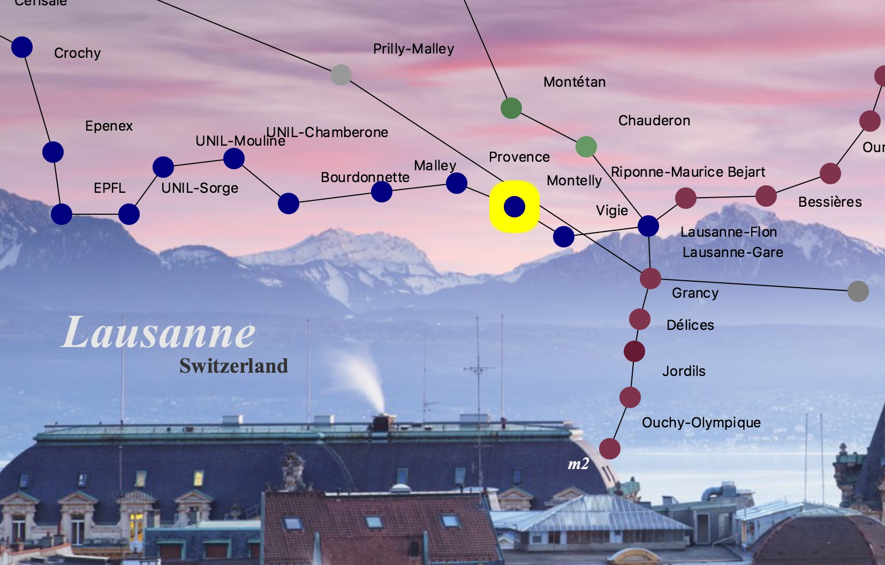
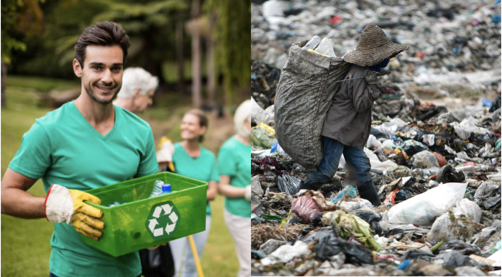
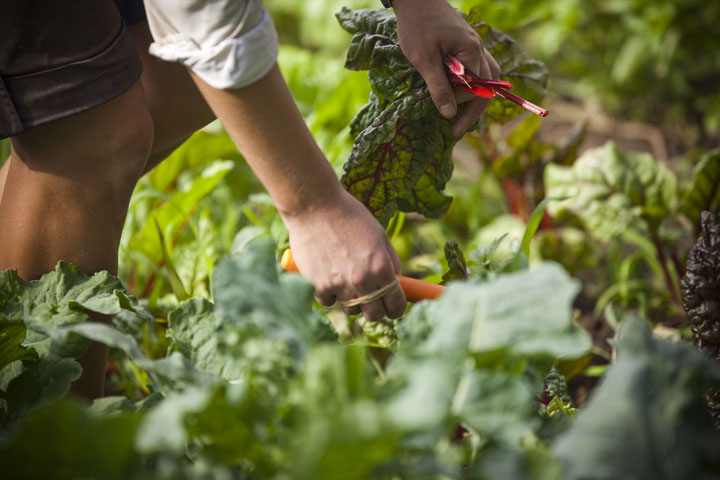

<!-- Main -->

<!-- One -->
<section id="one">
	

		
Most of these are projects from my university course. I worked with <b>Java, C++, Javascript, PHP, HTML and CSS</b>

	

</section>

<!-- Two -->

	

<section id="two" class="spotlights">
	<section>
		
		

			

				<header class="major">
					<h3>Metro Map Maker</h3>
				</header>
				
An application that allow users to create graphical representations to create subway maps with different customization levels. It's basically a Windows Paint built to create Subway maps.  Technologies used: <b>Java.</b>

				<ul class="actions">
					<li><a href="m3.html" class="button next">Details</a></li>
				</ul>
			

		

	</section>
<section>
		
		

			

				<header class="major">
					<h3>Where does our trash go? </h3>
				</header>
				
A comprehensive view of the world’s plastic waste movement - UNComtrade data
				 Technologies used: <b>Python, Vega</b>

				
				<ul class="actions">
					<li><a href="waste.html" class="button next">Details</a></li>
				</ul>
			

		

	</section>
	<section>
		
		

			

				<header class="major">
					<h3>The Greatest Farmer</h3>
				</header>
				
A platform for exchanging farming produce and agriculture practices within the local community. I got frustrated that farmers have to depend so much on the market's fluctuating prices, so we created this website to help connect local farmers with buyers. The website also supports blog posting and searching - a "Farming Wiki" for those who want to start growing food at home!  Technologies used: <b>Javascript, PHP, HTML, CSS.</b>
				<small>Photo courtesy of http://smallfarms.oregonstate.edu/</small>

				<ul class="actions">
					<li><a href="greatestfarmer.html" class="button next">Details</a></li>
				</ul>
			

		

	</section>

<!-- Three -->
<section id="three">
	

		<header class="major">
			<h3>Android currency exchange app</h3>
		</header>
		
This is something I've been thinking about but haven't yet got the chance to try. It's a simple app that convert prices once the user hover their phones over any price tag using OCR(Optical Character Recognization). I intend to use Javascript with ReactNative for this.

		<ul class="actions">
			<li><a href="generic.html" class="button">Coming soon</a></li>
		</ul>
	

</section>
