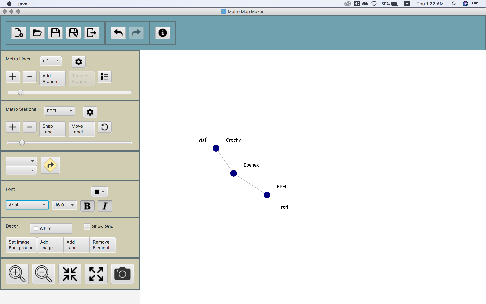
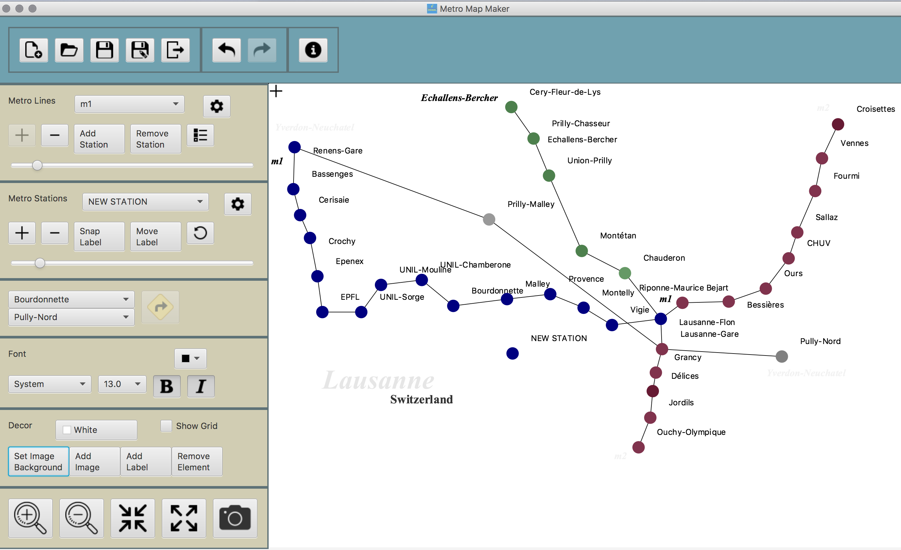
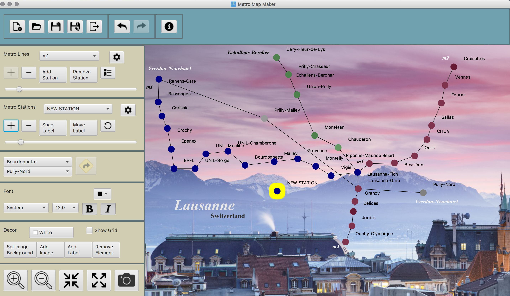
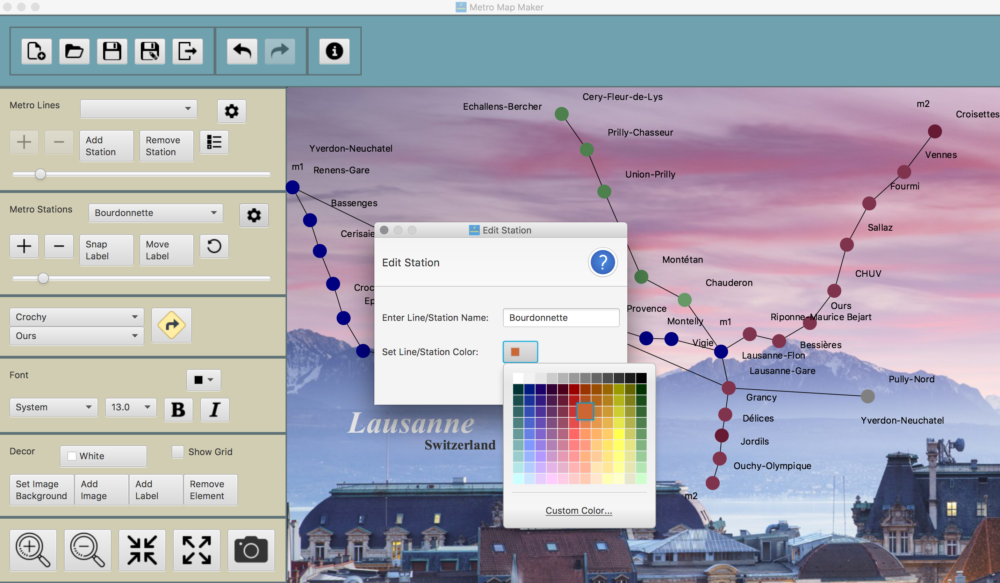
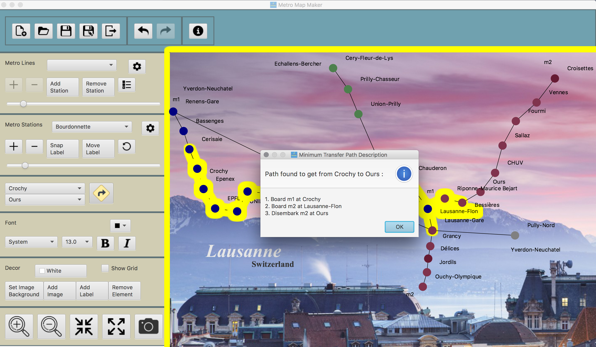

<!-- Content -->
<h3> Functionality Highlights</h3>
<ul>
<li>Save, Export Work</li>
<li>Undo, Redo system</li>
<li>Add, Delete, Modify Map ELements</li>
<li>Path finding</li>
</ul>

The application allows user to create graphical representations to create subway maps. The elements are: subway station, subway line, label, image. They can be edited and customized to adapt user's aesthetic needs. This project was done for CSE219 (Software Engineering) with <b>Java</b>. Head to <a href="https://github.com/btrantruong/metro-map-maker">my github page</a> to see source code.

<h3>1. Add elements</h3>

<figure>
  
  <figcaption> <i> - Start by adding stations and metro lines into the map. </i></figcaption>
</figure>

<h3>2. Keep at it</h3>
<figure>
  
  <figcaption><i> - After a while, the map will look something like this.</i></figcaption>
</figure>

Of course, you can <b>save your work</b> and come back to it later when you have time. After you've planned out the stations and subway postions, just hit save. <b>Editing is easy - click and drag</b> the station or label you want to move. For subway line, click the (-) button on the Subway Line toolbar.

<h3>3. Make it pretty</h3>
<figure>
  
  <figcaption><i> - Then choose a background that you like and click Export.</i></figcaption>
</figure>

Voila! You have yourself a map. Save the work and come back later for modifications or export into a .JPG image

<h3></h3>
<figure>
  
  <figcaption><i> - You can <b>edit station's name and color</b> as well as most of the elements on the map. </i></figcaption>
</figure>

<h3></h3>
<h3>4. Path Finding</h3>

To <b>find the minimum transfer path</b> from one station to another, simply choose the start station and your destination and click the big yellow "Find Route" button.

<figure>
  
  <figcaption><i> - How Find Route works.</i></figcaption>
</figure>

<h3> Role within the project </h3>

The project was done by me, according to the system specifications by Professor <a href="http://www3.cs.stonybrook.edu/~richard/">Richard McKenna </a>
